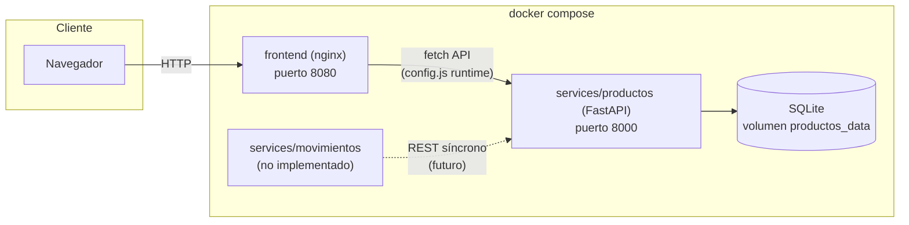
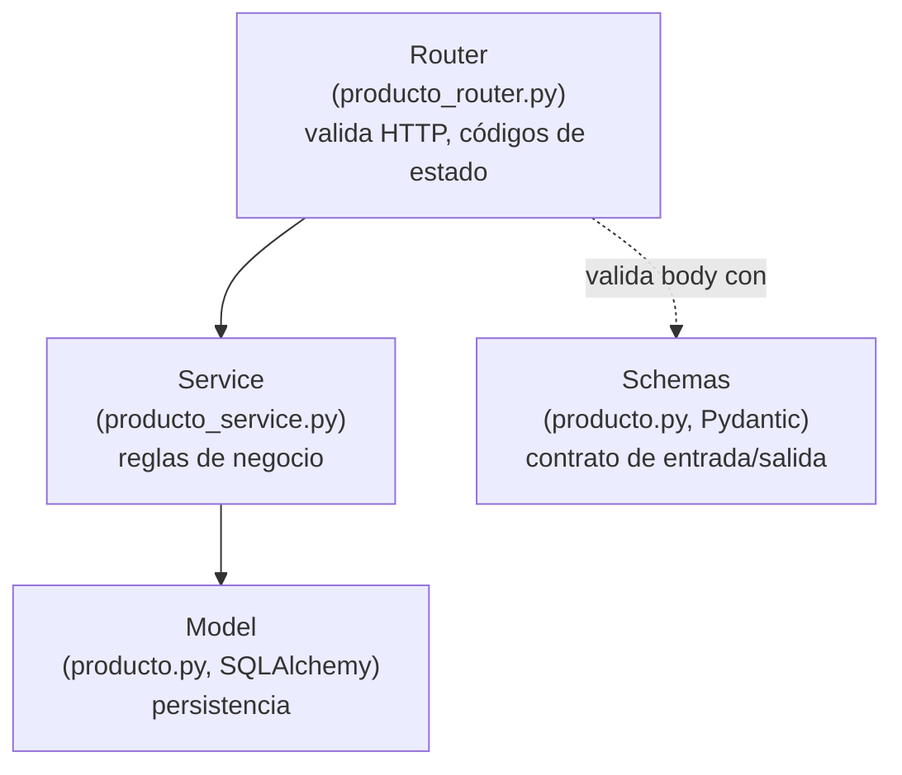
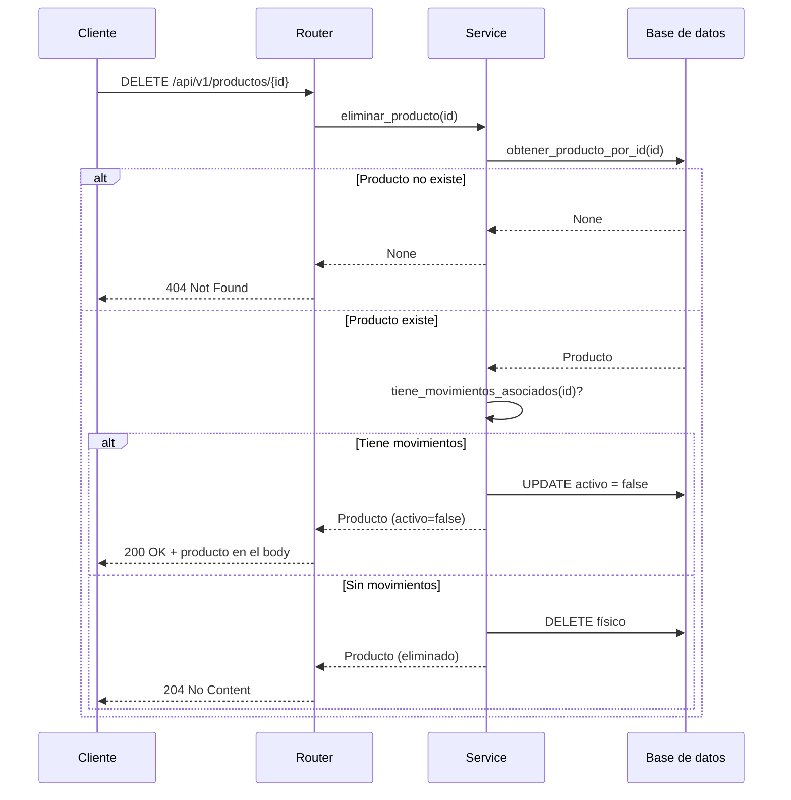

# Arquitectura

## Vista general de servicios

`movimientos` se dibuja punteado porque todavía no existe (ver
`services/movimientos/README.md`); la flecha muestra la comunicación
prevista una vez que se implemente: `movimientos` consultará y actualizará
stock en `productos` vía su API REST, en lugar de acceder directamente a
la base de datos de `productos`.

## Capas dentro de `services/productos`

El router nunca accede a la base de datos directamente: siempre pasa por
`producto_service`. Esto mantiene la lógica de negocio (por ejemplo, "si
tiene movimientos, dar de baja en vez de borrar") en un único lugar,
testeable de forma aislada del framework HTTP.

## Flujo de `DELETE /api/v1/productos/{id}` (issue #6)

## Decisión de persistencia

Ver `services/productos/README.md`, sección "Persistencia", para la
justificación de usar SQLite en lugar de un motor cliente-servidor como
Postgres en esta etapa del proyecto, y qué cambiaría para migrar.

## Limitaciones del sistema (resumen)

Cada servicio documenta sus propias limitaciones en detalle en su README.
A nivel de sistema completo, las más relevantes hoy son:

- No hay autenticación ni autorización en ninguna API.
- `services/movimientos` no está implementado: el soft delete de productos
  nunca se activa en la práctica todavía (`tiene_movimientos_asociados`
  siempre devuelve `False`).
- No hay un pipeline de CI configurado que corra los tests automáticamente
  en cada push/PR (los tests existen y pasan localmente, pero ejecutarlos
  hoy es un paso manual).
