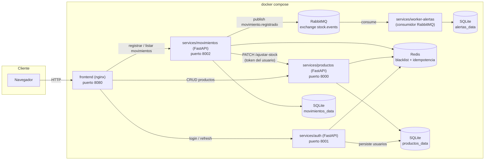
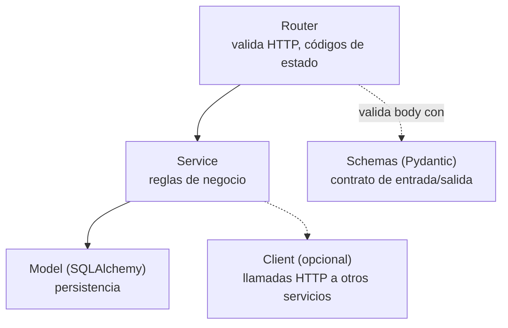
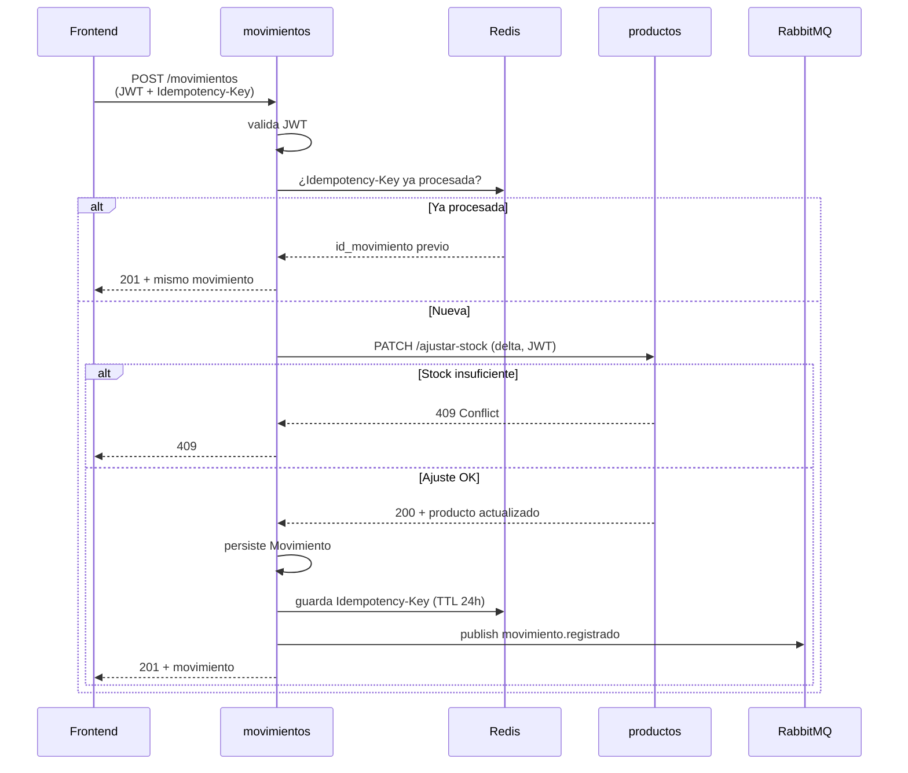
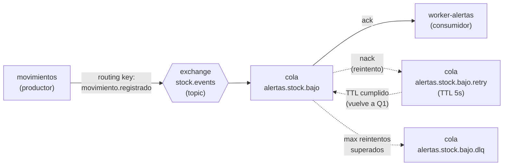
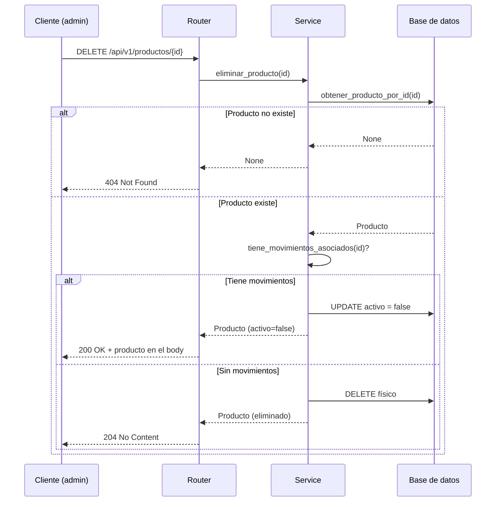

# Arquitectura

## Vista general de servicios

Cada servicio es un proceso independiente con su propio Dockerfile,
dependencias y (cuando corresponde) su propia base de datos:

- **`auth`**: emite y revoca JWT (access + refresh). Es el único que puede
  crear usuarios y firmar tokens. Persiste usuarios en su propia base.
- **`productos`**: dueño del catálogo y del `stock_actual`. Valida JWT
  localmente (mismo `AUTH_SECRET_KEY` que `auth`), consulta Redis para la
  blacklist de tokens revocados, y expone un endpoint atómico de ajuste de
  stock que consume `movimientos`.
- **`movimientos`**: registra el histórico de movimientos (solo inserciones).
  Orquesta la actualización de stock llamando a `productos` por REST
  (nunca lee su base directamente). Publica eventos de negocio en RabbitMQ.
- **`worker-alertas`**: consumidor asíncrono. Escucha el exchange
  `stock.events` y evalúa si corresponde alertar stock bajo. Es idempotente
  por `id_movimiento` y tiene reintentos con backoff + DLQ.
- **`frontend`**: nginx sirviendo HTML/JS estático. Genera su `config.js` en
  runtime a partir de variables de entorno.

## Capas dentro de un servicio

Todos los servicios backend siguen el mismo patrón de capas:

El router nunca accede a la base de datos directamente: siempre pasa por el
`Service`. Esto mantiene la lógica de negocio en un único lugar, testeable
de forma aislada del framework HTTP.

## Comunicación síncrona vs. asíncrona

El sistema usa **ambos** estilos de comunicación, cada uno donde corresponde:

| Tipo | Entre | Mecanismo | Por qué |
|---|---|---|---|
| **Síncrona** | `movimientos` → `productos` | REST (`PATCH /ajustar-stock`) | El movimiento no puede considerarse exitoso si el stock no se ajustó. La respuesta HTTP lleva el resultado (200/409) y el cliente espera. |
| **Asíncrona** | `movimientos` → `worker-alertas` | RabbitMQ (`movimiento.registrado`) | La alerta de stock bajo no bloquea la respuesta al usuario. Si el worker está caído, el evento queda encolado y se procesa cuando vuelva. |

Regla general: **lo que necesita respuesta inmediata es síncrono; lo que
puede esperar o es tolerante a fallos es asíncrono.**

## Flujo de `POST /api/v1/movimientos`

Si RabbitMQ está caído, el evento no se publica pero el movimiento **sí**
queda persistido: la respuesta al usuario no se bloquea por una falla de
mensajería (se loguea y sigue).

## Flujo del evento `movimiento.registrado`

El evento es **autocontenido**: incluye `stock_actual`, `stock_minimo` y
`nombre_producto` al momento del movimiento. El worker no necesita llamar a
`productos` (que además exige JWT de usuario, y el worker no lo tiene). Ver
`services/movimientos/EVENTOS.md` para el catálogo completo.

## Flujo de `DELETE /api/v1/productos/{id}`

Nota: el método `tiene_movimientos_asociados` en `productos` sigue siendo un
placeholder (`return False`) — la integración real con `movimientos`
consultaría su API o compartiría un evento. Queda documentado como deuda
técnica.

## Decisión de persistencia

Cada servicio es dueño de sus datos:

- `productos` → base propia con el catálogo y `stock_actual`.
- `movimientos` → base propia con el histórico.
- `worker-alertas` → base propia (SQLite local) solo para idempotencia.

**Ningún servicio accede directamente a la base de otro.** Toda
comunicación entre servicios es vía API REST o eventos. Ver
`services/productos/README.md`, sección "Persistencia", para la
justificación de SQLite en esta etapa y qué cambiaría para migrar a
Postgres.

## Concurrencia en el ajuste de stock

`POST /movimientos` puede recibir múltiples requests concurrentes sobre el
mismo producto (dos ventas simultáneas, por ejemplo). Un ajuste "leer →
validar en Python → escribir" permite sobreventa.

La solución implementada está en `productos`: el endpoint
`PATCH /api/v1/productos/{id}/ajustar-stock` evalúa la condición de stock
dentro de la propia sentencia `UPDATE ... WHERE stock_actual >= n`, así que
la base resuelve la carrera atómicamente. Ver el `README.md` raíz, sección
"Concurrencia", para el detalle del problema, el mecanismo y los tests.

## Limitaciones del sistema (resumen)

Cada servicio documenta sus propias limitaciones en detalle en su README.
A nivel de sistema completo, las más relevantes hoy son:

- **`tiene_movimientos_asociados` no está integrado**: el servicio
  `productos` no consulta a `movimientos` para decidir si un producto se
  puede borrar físicamente. Hoy siempre devuelve `False`, así que la baja
  lógica nunca se activa en la práctica.
- **SQLite en lugar de un motor cliente-servidor**: adecuado para la etapa
  actual del proyecto, pero limita la concurrencia real y la separación
  física de datos. Migrar a Postgres es un cambio acotado (la capa de
  SQLAlchemy está aislada en `database/db.py` de cada servicio).
- **`worker-alertas` no tiene healthcheck HTTP**: es un proceso de
  background, se monitorea por logs (`docker compose logs -f
  worker-alertas`). `docker compose ps` no puede mostrar `healthy` para él.
- **Sin pipeline de CI**: los tests existen y pasan localmente, pero
  ejecutarlos es un paso manual. Falta un workflow de GitHub Actions que
  corra `pytest` en cada push.
- **`fakeredis` en modo local**: cuando se corre sin Docker, `productos` y
  `movimientos` usan `fakeredis` (Redis en memoria por proceso) para evitar
  requerir Redis real. El logout no invalida tokens en ese modo; solo
  funciona con Redis compartido (que es lo que usa `docker compose`).